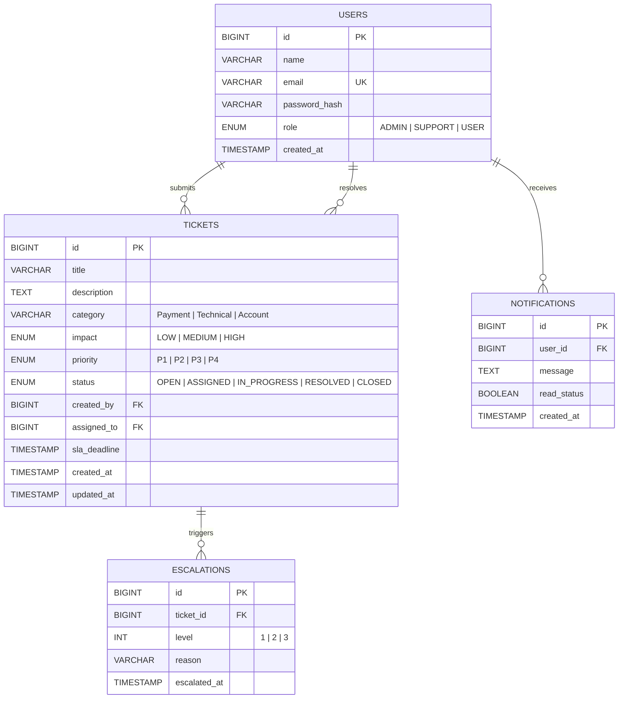

# 🗄️ ER Diagram — SETS

## Overview

The SETS database schema is designed for efficient ticket tracking, relational SLA enforcement, and immutable audit logs. It uses specialized tables for escalations and notifications to keep the core ticket table clean.

---

## Mermaid ER Diagram

### Relational Schema Logic Summary

| Relationship | Cardinality | Purpose |
| :--- | :--- | :--- |
| **User → Ticket** | `1:N` | Separation of `created_by` (End User) and `assigned_to` (Support Agent). |
| **Ticket → Escalation** | `1:N` | Tracks the history of escalation levels for a single breached ticket. |
| **User → Notification** | `1:N` | Decouples alerts from core entities, allowing for per-user notification management. |
| **SLA Storage** | `Attribute` | `sla_deadline` is computed and stored at creation to avoid repetitive runtime math. |

---

## Table Definitions

### 1. `USERS`
Stores identity and RBAC role. Roles dictate access to specific API endpoints.

### 2. `TICKETS`
The core transactional table. Stores state, classification, and timing metadata.

### 3. `ESCALATIONS`
A support table that historicalizes every time a ticket breaches an SLA and moves up the level chain.

### 4. `NOTIFICATIONS`
A utility table for in-app messaging. Linked to users to track unread status.
