# 🗄️ ER Diagram — SIEMS

## Overview

This Entity-Relationship diagram represents the database schema for SIEMS. The design uses a **relational model** with properly normalized tables, foreign key constraints, and indexed columns for query performance. The schema is consistent with the class diagram and supports the full incident lifecycle.

---

## Mermaid ER Diagram

```mermaid
erDiagram
    USERS {
        BIGINT id PK "Auto-increment primary key"
        VARCHAR name "NOT NULL — Full name of the user"
        VARCHAR email UK "NOT NULL UNIQUE — Login identifier"
        VARCHAR password_hash "NOT NULL — BCrypt hashed password"
        ENUM role "NOT NULL — ADMIN | MANAGER | ENGINEER"
        TIMESTAMP created_at "DEFAULT CURRENT_TIMESTAMP"
    }

    INCIDENTS {
        BIGINT id PK "Auto-increment primary key"
        VARCHAR title "NOT NULL — Brief incident title"
        TEXT description "NOT NULL — Detailed incident description"
        ENUM severity "NOT NULL — LOW | MEDIUM | HIGH | CRITICAL"
        ENUM status "NOT NULL DEFAULT OPEN — OPEN | ASSIGNED | IN_PROGRESS | RESOLVED | CLOSED | ESCALATED"
        BIGINT created_by FK "NOT NULL — References USERS(id)"
        BIGINT assigned_to FK "NULLABLE — References USERS(id)"
        TIMESTAMP created_at "DEFAULT CURRENT_TIMESTAMP"
        TIMESTAMP updated_at "ON UPDATE CURRENT_TIMESTAMP"
    }

    INCIDENT_LOGS {
        BIGINT id PK "Auto-increment primary key"
        BIGINT incident_id FK "NOT NULL — References INCIDENTS(id)"
        ENUM action "NOT NULL — INCIDENT_CREATED | INCIDENT_ASSIGNED | STATUS_CHANGED | AUTO_ESCALATED | INCIDENT_RESOLVED | INCIDENT_CLOSED"
        ENUM old_status "NULLABLE — Previous incident status"
        ENUM new_status "NOT NULL — New incident status after action"
        BIGINT performed_by FK "NULLABLE — References USERS(id), NULL for system actions"
        TIMESTAMP timestamp "DEFAULT CURRENT_TIMESTAMP"
    }

    ESCALATION_RULES {
        BIGINT id PK "Auto-increment primary key"
        ENUM severity "NOT NULL — LOW | MEDIUM | HIGH | CRITICAL"
        INT timeout_minutes "NOT NULL — Minutes before escalation triggers"
        ENUM escalate_to_role "NOT NULL — Target role for escalation (MANAGER)"
        BOOLEAN is_active "DEFAULT TRUE — Whether rule is currently enforced"
    }

    %% ═══════════════════════════════════════
    %% RELATIONSHIPS
    %% ═══════════════════════════════════════

    USERS ||--o{ INCIDENTS : "creates"
    USERS ||--o{ INCIDENTS : "is assigned"
    USERS ||--o{ INCIDENT_LOGS : "performs action"
    INCIDENTS ||--o{ INCIDENT_LOGS : "has audit trail"
    ESCALATION_RULES }o--|| USERS : "escalates to role"
```

---

## Table Definitions

### 1. `USERS`

Stores all system users with role-based classification.

| Column          | Type          | Constraints                    | Description                        |
|-----------------|---------------|--------------------------------|------------------------------------|
| `id`            | `BIGINT`      | `PK`, `AUTO_INCREMENT`         | Unique user identifier             |
| `name`          | `VARCHAR(100)`| `NOT NULL`                     | Full name                          |
| `email`         | `VARCHAR(255)`| `NOT NULL`, `UNIQUE`           | Login email (unique identifier)    |
| `password_hash` | `VARCHAR(255)`| `NOT NULL`                     | BCrypt hashed password             |
| `role`          | `ENUM`        | `NOT NULL`                     | One of: `ADMIN`, `MANAGER`, `ENGINEER` |
| `created_at`    | `TIMESTAMP`   | `DEFAULT CURRENT_TIMESTAMP`    | Account creation timestamp         |

**Indexes:** `idx_users_email` (UNIQUE), `idx_users_role`

---

### 2. `INCIDENTS`

Core table tracking all reported incidents and their current state.

| Column          | Type          | Constraints                    | Description                        |
|-----------------|---------------|--------------------------------|------------------------------------|
| `id`            | `BIGINT`      | `PK`, `AUTO_INCREMENT`         | Unique incident identifier         |
| `title`         | `VARCHAR(255)`| `NOT NULL`                     | Brief incident summary             |
| `description`   | `TEXT`        | `NOT NULL`                     | Detailed description               |
| `severity`      | `ENUM`        | `NOT NULL`                     | `LOW`, `MEDIUM`, `HIGH`, `CRITICAL`|
| `status`        | `ENUM`        | `NOT NULL`, `DEFAULT 'OPEN'`   | Current lifecycle state            |
| `created_by`    | `BIGINT`      | `FK → USERS(id)`, `NOT NULL`   | Engineer who reported              |
| `assigned_to`   | `BIGINT`      | `FK → USERS(id)`, `NULLABLE`   | Engineer assigned to resolve       |
| `created_at`    | `TIMESTAMP`   | `DEFAULT CURRENT_TIMESTAMP`    | When incident was reported         |
| `updated_at`    | `TIMESTAMP`   | `ON UPDATE CURRENT_TIMESTAMP`  | Last modification timestamp        |

**Indexes:** `idx_incidents_status`, `idx_incidents_severity`, `idx_incidents_created_by`, `idx_incidents_assigned_to`

---

### 3. `INCIDENT_LOGS`

Immutable audit trail of every action taken on an incident.

| Column          | Type          | Constraints                    | Description                        |
|-----------------|---------------|--------------------------------|------------------------------------|
| `id`            | `BIGINT`      | `PK`, `AUTO_INCREMENT`         | Unique log entry identifier        |
| `incident_id`   | `BIGINT`      | `FK → INCIDENTS(id)`, `NOT NULL`| Parent incident reference         |
| `action`        | `ENUM`        | `NOT NULL`                     | Type of action performed           |
| `old_status`    | `ENUM`        | `NULLABLE`                     | Status before action (NULL for creation) |
| `new_status`    | `ENUM`        | `NOT NULL`                     | Status after action                |
| `performed_by`  | `BIGINT`      | `FK → USERS(id)`, `NULLABLE`   | Actor (NULL for system/scheduler)  |
| `timestamp`     | `TIMESTAMP`   | `DEFAULT CURRENT_TIMESTAMP`    | When action occurred               |

**Indexes:** `idx_logs_incident_id`, `idx_logs_performed_by`, `idx_logs_timestamp`

---

### 4. `ESCALATION_RULES`

Configurable rules defining when and how incidents should be escalated.

| Column            | Type          | Constraints                    | Description                        |
|-------------------|---------------|--------------------------------|------------------------------------|
| `id`              | `BIGINT`      | `PK`, `AUTO_INCREMENT`         | Unique rule identifier             |
| `severity`        | `ENUM`        | `NOT NULL`                     | Target severity level              |
| `timeout_minutes` | `INT`         | `NOT NULL`                     | Minutes before escalation triggers |
| `escalate_to_role`| `ENUM`        | `NOT NULL`                     | Role to notify on escalation       |
| `is_active`       | `BOOLEAN`     | `DEFAULT TRUE`                 | Whether rule is currently active   |

**Indexes:** `idx_rules_severity`, `idx_rules_active`

---

### Relational Schema Logic Summary

| Relationship | Cardinality | Key Rationale |
| :--- | :--- | :--- |
| **User → Incident** | `1:N` | One user (Engineer) creates many incidents; one user (Manager) manages many. |
| **Incident → Log** | `1:N` | An immutable trail of many log entries belongs to exactly one incident. |
| **Rule → Incident** | `1:N` | A single escalation rule applies to many incidents based on severity. |
| **User → Log** | `1:N` | Audit trail tracks which specific user performed a lifecycle action. |

---

## State Transition Constraints

The `status` field in `INCIDENTS` follows strict state machine rules:

> **Note:** Invalid transitions (e.g., `CLOSED → OPEN`) are rejected at the service layer before reaching the database.
