# 🏗️ Class Diagram — SIEMS

## Overview

This class diagram models the complete object-oriented design of SIEMS, including entity classes, service interfaces, repository interfaces, and their relationships. The design follows **SOLID principles**, uses **inheritance** for user roles, the **Strategy pattern** for escalation rules, and the **Repository pattern** for data access.

---

## Mermaid Class Diagram

```mermaid
classDiagram
    direction TB

    %% ═══════════════════════════════════════
    %% ENUMERATIONS
    %% ═══════════════════════════════════════
    class Role {
        <<enumeration>>
        ADMIN
        MANAGER
        ENGINEER
    }

    class Severity {
        <<enumeration>>
        LOW
        MEDIUM
        HIGH
        CRITICAL
    }

    class IncidentStatus {
        <<enumeration>>
        OPEN
        ASSIGNED
        IN_PROGRESS
        RESOLVED
        CLOSED
        ESCALATED
    }

    class AuditAction {
        <<enumeration>>
        INCIDENT_CREATED
        INCIDENT_ASSIGNED
        STATUS_CHANGED
        AUTO_ESCALATED
        INCIDENT_RESOLVED
        INCIDENT_CLOSED
    }

    %% ═══════════════════════════════════════
    %% ENTITY CLASSES
    %% ═══════════════════════════════════════
    class User {
        <<abstract>>
        #Long id
        #String name
        #String email
        #String passwordHash
        #Role role
        #LocalDateTime createdAt
        +getId() Long
        +getName() String
        +getEmail() String
        +getRole() Role
        +hasPermission(String action)* boolean
    }

    class Admin {
        -List~EscalationRule~ managedRules
        +hasPermission(String action) boolean
        +manageUsers() void
        +configureEscalationRules() void
        +viewAnalytics() AnalyticsDTO
    }

    class Manager {
        -List~Incident~ teamIncidents
        +hasPermission(String action) boolean
        +assignIncident(Incident, Engineer) void
        +viewTeamIncidents() List~Incident~
        +handleEscalation(Incident) void
    }

    class Engineer {
        -List~Incident~ assignedIncidents
        +hasPermission(String action) boolean
        +createIncident(IncidentDTO) Incident
        +updateIncidentStatus(Long, IncidentStatus) void
        +resolveIncident(Long) void
    }

    class Incident {
        -Long id
        -String title
        -String description
        -Severity severity
        -IncidentStatus status
        -User createdBy
        -User assignedTo
        -LocalDateTime createdAt
        -LocalDateTime updatedAt
        -List~IncidentLog~ logs
        +getId() Long
        +getStatus() IncidentStatus
        +getSeverity() Severity
        +transitionTo(IncidentStatus newStatus) boolean
        +isEscalationCandidate() boolean
        +getElapsedMinutes() long
    }

    class IncidentLog {
        -Long id
        -Incident incident
        -AuditAction action
        -IncidentStatus oldStatus
        -IncidentStatus newStatus
        -User performedBy
        -LocalDateTime timestamp
        +getId() Long
        +getAction() AuditAction
        +getTimestamp() LocalDateTime
    }

    class EscalationRule {
        -Long id
        -Severity severity
        -int timeoutMinutes
        -Role escalateToRole
        -boolean isActive
        +getId() Long
        +getSeverity() Severity
        +getTimeoutMinutes() int
        +isApplicable(Incident) boolean
        +shouldEscalate(Incident) boolean
    }

    %% ═══════════════════════════════════════
    %% SERVICE INTERFACES
    %% ═══════════════════════════════════════
    class IAuthService {
        <<interface>>
        +register(UserDTO) User
        +login(LoginDTO) AuthTokenDTO
        +validateToken(String token) User
        +hashPassword(String raw) String
    }

    class IIncidentService {
        <<interface>>
        +createIncident(IncidentDTO) Incident
        +assignIncident(Long incidentId, Long engineerId) Incident
        +updateStatus(Long incidentId, IncidentStatus status) Incident
        +getIncidentById(Long id) Incident
        +getIncidentsByUser(Long userId) List~Incident~
        +getAllIncidents() List~Incident~
    }

    class IEscalationService {
        <<interface>>
        +checkPendingEscalations() void
        +escalateIncident(Long incidentId) void
        +getActiveRules() List~EscalationRule~
    }

    class IAuditService {
        <<interface>>
        +logAction(AuditAction, Long incidentId, IncidentStatus old, IncidentStatus new_, Long actorId) void
        +getLogsByIncident(Long incidentId) List~IncidentLog~
    }

    class IAnalyticsService {
        <<interface>>
        +getAverageResolutionTime() double
        +getEscalationRate() double
        +getIncidentsBySeverity() Map~Severity, Long~
        +getTeamPerformance() List~TeamMetricDTO~
    }

    %% ═══════════════════════════════════════
    %% SERVICE IMPLEMENTATIONS
    %% ═══════════════════════════════════════
    class AuthService {
        -IUserRepository userRepository
        -JwtUtil jwtUtil
        +register(UserDTO) User
        +login(LoginDTO) AuthTokenDTO
        +validateToken(String token) User
        +hashPassword(String raw) String
    }

    class IncidentService {
        -IIncidentRepository incidentRepository
        -IAuditService auditService
        +createIncident(IncidentDTO) Incident
        +assignIncident(Long, Long) Incident
        +updateStatus(Long, IncidentStatus) Incident
        +getIncidentById(Long) Incident
        +getIncidentsByUser(Long) List~Incident~
        +getAllIncidents() List~Incident~
        -validateTransition(IncidentStatus, IncidentStatus) boolean
    }

    class EscalationService {
        -IIncidentRepository incidentRepository
        -IEscalationRuleRepository ruleRepository
        -IIncidentService incidentService
        -IAuditService auditService
        -IEscalationStrategy escalationStrategy
        +checkPendingEscalations() void
        +escalateIncident(Long) void
        +getActiveRules() List~EscalationRule~
    }

    %% ═══════════════════════════════════════
    %% STRATEGY PATTERN
    %% ═══════════════════════════════════════
    class IEscalationStrategy {
        <<interface>>
        +evaluate(Incident, EscalationRule) boolean
        +execute(Incident) void
    }

    class TimeBasedEscalationStrategy {
        +evaluate(Incident, EscalationRule) boolean
        +execute(Incident) void
    }

    class SeverityBasedEscalationStrategy {
        +evaluate(Incident, EscalationRule) boolean
        +execute(Incident) void
    }

    %% ═══════════════════════════════════════
    %% REPOSITORY INTERFACES
    %% ═══════════════════════════════════════
    class IUserRepository {
        <<interface>>
        +findById(Long id) Optional~User~
        +findByEmail(String email) Optional~User~
        +findByRole(Role role) List~User~
        +save(User user) User
        +deleteById(Long id) void
    }

    class IIncidentRepository {
        <<interface>>
        +findById(Long id) Optional~Incident~
        +findByAssignedTo(Long userId) List~Incident~
        +findByCreatedBy(Long userId) List~Incident~
        +findByStatus(IncidentStatus status) List~Incident~
        +findUnresolvedBySeverity(Severity sev) List~Incident~
        +save(Incident incident) Incident
    }

    class IEscalationRuleRepository {
        <<interface>>
        +findBySeverity(Severity sev) List~EscalationRule~
        +findActiveRules() List~EscalationRule~
        +save(EscalationRule rule) EscalationRule
    }

    class IIncidentLogRepository {
        <<interface>>
        +findByIncidentId(Long id) List~IncidentLog~
        +save(IncidentLog log) IncidentLog
    }

    %% ═══════════════════════════════════════
    %% CONTROLLERS
    %% ═══════════════════════════════════════
    class AuthController {
        -IAuthService authService
        +register(UserDTO) ResponseEntity
        +login(LoginDTO) ResponseEntity
    }

    class IncidentController {
        -IIncidentService incidentService
        +createIncident(IncidentDTO) ResponseEntity
        +assignIncident(Long, AssignDTO) ResponseEntity
        +updateStatus(Long, StatusDTO) ResponseEntity
        +getIncident(Long) ResponseEntity
        +getAllIncidents() ResponseEntity
    }

    class AdminController {
        -IAnalyticsService analyticsService
        -IEscalationService escalationService
        +getAnalytics() ResponseEntity
        +configureRule(EscalationRuleDTO) ResponseEntity
    }

    %% ═══════════════════════════════════════
    %% RELATIONSHIPS
    %% ═══════════════════════════════════════

    %% Inheritance
    User <|-- Admin : extends
    User <|-- Manager : extends
    User <|-- Engineer : extends

    %% Strategy Pattern
    IEscalationStrategy <|.. TimeBasedEscalationStrategy : implements
    IEscalationStrategy <|.. SeverityBasedEscalationStrategy : implements

    %% Service Implementations
    IAuthService <|.. AuthService : implements
    IIncidentService <|.. IncidentService : implements
    IEscalationService <|.. EscalationService : implements

    %% Composition & Association
    Incident "1" *-- "0..*" IncidentLog : contains
    Incident "0..*" --> "1" User : createdBy
    Incident "0..*" --> "0..1" User : assignedTo
    IncidentLog "0..*" --> "1" User : performedBy
    EscalationRule --> Severity : targets

    %% Dependencies (Service → Repository)
    AuthService --> IUserRepository : depends on
    IncidentService --> IIncidentRepository : depends on
    IncidentService --> IAuditService : depends on
    EscalationService --> IIncidentRepository : depends on
    EscalationService --> IEscalationRuleRepository : depends on
    EscalationService --> IEscalationStrategy : uses

    %% Controller → Service
    AuthController --> IAuthService : depends on
    IncidentController --> IIncidentService : depends on
    AdminController --> IAnalyticsService : depends on
    AdminController --> IEscalationService : depends on

    %% Enum Usage
    User --> Role : has
    Incident --> Severity : has
    Incident --> IncidentStatus : has
    IncidentLog --> AuditAction : has
```

---

### Architectural Design Summary

| Pattern / Principle | Application in SIEMS | Rationale |
| :--- | :--- | :--- |
| **Strategy Pattern** | Pluggable `IEscalationStrategy` | Allows adding new escalation logic without modifying the core service. |
| **Repository Pattern** | Abstraction of `IIncidentRepository` | Decouples business logic from persistence, facilitating testing and migrations. |
| **Abstraction** | Service Interfaces (`IAuthService`) | Ensures loose coupling between controllers and business logic. |
| **Inheritance** | Abstract `User` base class | Minimizes redundancy across Admin, Manager, and Engineer roles. |
| **Composition** | `Incident` contains `IncidentLogs` | Tracks lifecycle history as a first-class citizen of the incident entity. |
| **Encapsulation** | State machine logic in Service | Prevents invalid state transitions at the business layer. |
