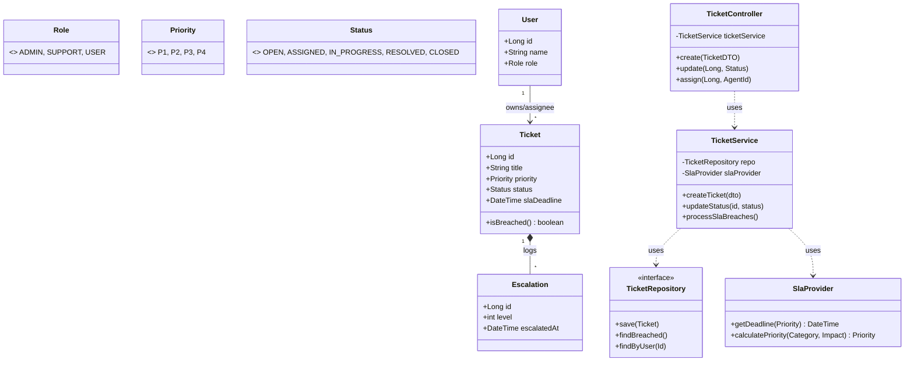

#  Class Diagram — SETS

## Overview

The SETS class structure follows a **Service-Repository** pattern. Business logic for SLA calculation and escalation level selection is encapsulated within the `TicketService`.

---

## Mermaid Class Diagram

### Architectural Design Summary

| Pattern / Principle | Application in SETS | Rationale |
| :--- | :--- | :--- |
| **Layered Architecture** | Controller → Service → Repo | Clear separation between transport, business, and data layers. |
| **Service Encapsulation** | `SlaProvider` in `TicketService` | Centralizes priority and deadline logic away from API routes. |
| **Repository Pattern** | `TicketRepository` interface | Abstracts persistence details for better testability. |
| **State Management** | Enum-based `Status` | Ensures type-safe transitions throughout the ticket lifecycle. |
| **Observer Logic** | Notification trigger in Service | Handled within service flow to ensure alerts follow state changes. |
