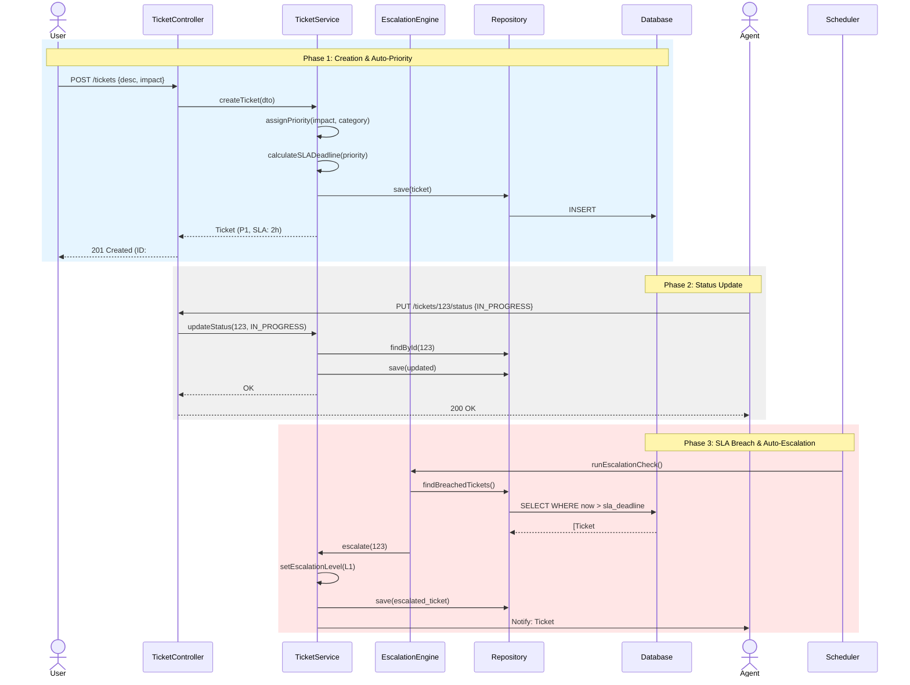

#  Sequence Diagram — SETS

## Overview

This diagram maps the lifecycle of a ticket from creation to automatic escalation. It demonstrates the coordination between the layered architecture and the background job system.

---

## Main Flow: Ticket Lifecycle & SLA Escalation

### Sequence Flow Summary

| Phase | Trigger | Actor/System | Action | Outcome |
| :--- | :--- | :--- | :--- | :--- |
| **1. Submission** | Form submitted | `User` | Priority & SLA calculation | Ticket #ID created with deadline. |
| **2. Processing** | Agent starts work | `Agent` | Status change | Progress tracked with timestamp. |
| **3. Monitoring** | Cron Job (5 min) | `Scheduler` | Breach check | Ticket bumped to next level. |
| **4. Alerting** | SLA Breach | `EscalationEngine` | Send notification | Agent/Senior notified immediately. |
