# 🔄 Sequence Diagram — SIEMS

## Overview

This sequence diagram illustrates the **primary incident lifecycle flow** — from creation through assignment, status updates, and automatic escalation. It demonstrates the layered architecture (Controller → Service → Repository → Database) and the background scheduler's role in enforcing escalation policies.

---

## Main Flow: Incident Lifecycle with Auto-Escalation

```mermaid
sequenceDiagram
    actor Eng as 🔧 Engineer
    participant FE as Frontend (React)
    participant IC as IncidentController
    participant IS as IncidentService
    participant IR as IncidentRepository
    participant DB as Database
    participant AS as AuditService
    actor Mgr as 📋 Manager
    participant ES as EscalationService
    participant SCH as ⏱️ Scheduler

    %% ═══════════════════════════════════════
    %% PHASE 1: Incident Creation
    %% ═══════════════════════════════════════
    rect rgb(230, 245, 255)
        Note over Eng, DB: Phase 1 — Incident Creation
        Eng ->> FE: Fill incident form (title, description, severity=HIGH)
        FE ->> IC: POST /api/incidents {title, desc, severity}
        IC ->> IC: Validate request body
        IC ->> IS: createIncident(incidentDTO)
        IS ->> IS: Set status = OPEN, timestamps
        IS ->> IR: save(incident)
        IR ->> DB: INSERT INTO incidents
        DB -->> IR: Incident (id=101)
        IR -->> IS: Incident entity
        IS ->> AS: logAction(INCIDENT_CREATED, incident_id=101, actor=Engineer)
        AS ->> DB: INSERT INTO incident_logs
        IS -->> IC: IncidentResponseDTO
        IC -->> FE: 201 Created {id: 101, status: OPEN}
        FE -->> Eng: ✅ Incident #101 created
    end

    %% ═══════════════════════════════════════
    %% PHASE 2: Incident Assignment
    %% ═══════════════════════════════════════
    rect rgb(255, 245, 230)
        Note over Mgr, DB: Phase 2 — Manager Assigns Incident
        Mgr ->> FE: Select incident #101, assign to Engineer
        FE ->> IC: PUT /api/incidents/101/assign {assigneeId: eng_01}
        IC ->> IS: assignIncident(101, eng_01)
        IS ->> IR: findById(101)
        IR ->> DB: SELECT * FROM incidents WHERE id=101
        DB -->> IR: Incident (status=OPEN)
        IR -->> IS: Incident entity
        IS ->> IS: Validate: status == OPEN
        IS ->> IS: Set status = ASSIGNED, assigned_to = eng_01
        IS ->> IR: save(incident)
        IR ->> DB: UPDATE incidents SET status=ASSIGNED, assigned_to=eng_01
        DB -->> IR: Updated
        IS ->> AS: logAction(INCIDENT_ASSIGNED, old=OPEN, new=ASSIGNED)
        AS ->> DB: INSERT INTO incident_logs
        IS -->> IC: IncidentResponseDTO
        IC -->> FE: 200 OK {status: ASSIGNED}
        FE -->> Mgr: ✅ Incident assigned to Engineer
    end

    %% ═══════════════════════════════════════
    %% PHASE 3: Engineer Updates Status
    %% ═══════════════════════════════════════
    rect rgb(230, 255, 230)
        Note over Eng, DB: Phase 3 — Engineer Begins Work
        Eng ->> FE: Update incident #101 to IN_PROGRESS
        FE ->> IC: PUT /api/incidents/101/status {status: IN_PROGRESS}
        IC ->> IS: updateStatus(101, IN_PROGRESS)
        IS ->> IR: findById(101)
        IR ->> DB: SELECT * FROM incidents WHERE id=101
        DB -->> IR: Incident (status=ASSIGNED)
        IR -->> IS: Incident entity
        IS ->> IS: Validate transition: ASSIGNED → IN_PROGRESS ✅
        IS ->> IS: Set status = IN_PROGRESS, updated_at = now()
        IS ->> IR: save(incident)
        IR ->> DB: UPDATE incidents SET status=IN_PROGRESS
        DB -->> IR: Updated
        IS ->> AS: logAction(STATUS_CHANGED, old=ASSIGNED, new=IN_PROGRESS)
        AS ->> DB: INSERT INTO incident_logs
        IS -->> IC: IncidentResponseDTO
        IC -->> FE: 200 OK {status: IN_PROGRESS}
        FE -->> Eng: ✅ Status updated
    end

    %% ═══════════════════════════════════════
    %% PHASE 4: Auto-Escalation (Timeout)
    %% ═══════════════════════════════════════
    rect rgb(255, 230, 230)
        Note over SCH, DB: Phase 4 — Auto-Escalation (Severity=HIGH, Timeout Breached)
        SCH ->> ES: checkPendingEscalations()
        ES ->> IR: findUnresolvedBySeverity(HIGH)
        IR ->> DB: SELECT * FROM incidents WHERE severity=HIGH AND status NOT IN (RESOLVED, CLOSED, ESCALATED)
        DB -->> IR: [Incident #101 — IN_PROGRESS, 45 min elapsed]
        IR -->> ES: List of candidate incidents
        ES ->> DB: SELECT * FROM escalation_rules WHERE severity=HIGH AND is_active=true
        DB -->> ES: EscalationRule {timeout: 30min, escalate_to: MANAGER}
        ES ->> ES: Evaluate: elapsed(45min) > timeout(30min) → ESCALATE ⚠️
        ES ->> IS: escalateIncident(101)
        IS ->> IS: Set status = ESCALATED
        IS ->> IR: save(incident)
        IR ->> DB: UPDATE incidents SET status=ESCALATED
        DB -->> IR: Updated
        IS ->> AS: logAction(AUTO_ESCALATED, old=IN_PROGRESS, new=ESCALATED)
        AS ->> DB: INSERT INTO incident_logs
        ES ->> Mgr: 🔔 Notification: Incident #101 escalated!
        Note over Mgr: Manager receives alert and takes action
    end
```



---

### Sequence Flow Summary

| Phase | Trigger | Actor/System | Key Action | Result |
| :--- | :--- | :--- | :--- | :--- |
| **1. Reporting** | Incident reported | `Engineer` | `POST /api/incidents` | Status: `OPEN` |
| **2. Management** | Manager assigns | `Manager` | `PUT /incidents/:id/assign` | Status: `ASSIGNED` |
| **3. Execution** | Work begins | `Engineer` | `PUT /incidents/:id/status` | Status: `IN_PROGRESS` |
| **4. Automation** | Timeout breached | `System Scheduler` | `checkPendingEscalations()` | Status: `ESCALATED` |

---

## Architectural Layers Demonstrated

```
Frontend  →  Controller  →  Service  →  Repository  →  Database
                              ↕
                        AuditService
                              ↕
                      EscalationService ← Scheduler
```

- **Controller Layer** — Request validation, route handling, HTTP response mapping
- **Service Layer** — Business logic, state validation, orchestration
- **Repository Layer** — Data access abstraction, query construction
- **AuditService** — Cross-cutting concern for immutable logging
- **Scheduler** — Autonomous background process for time-based escalation checks
