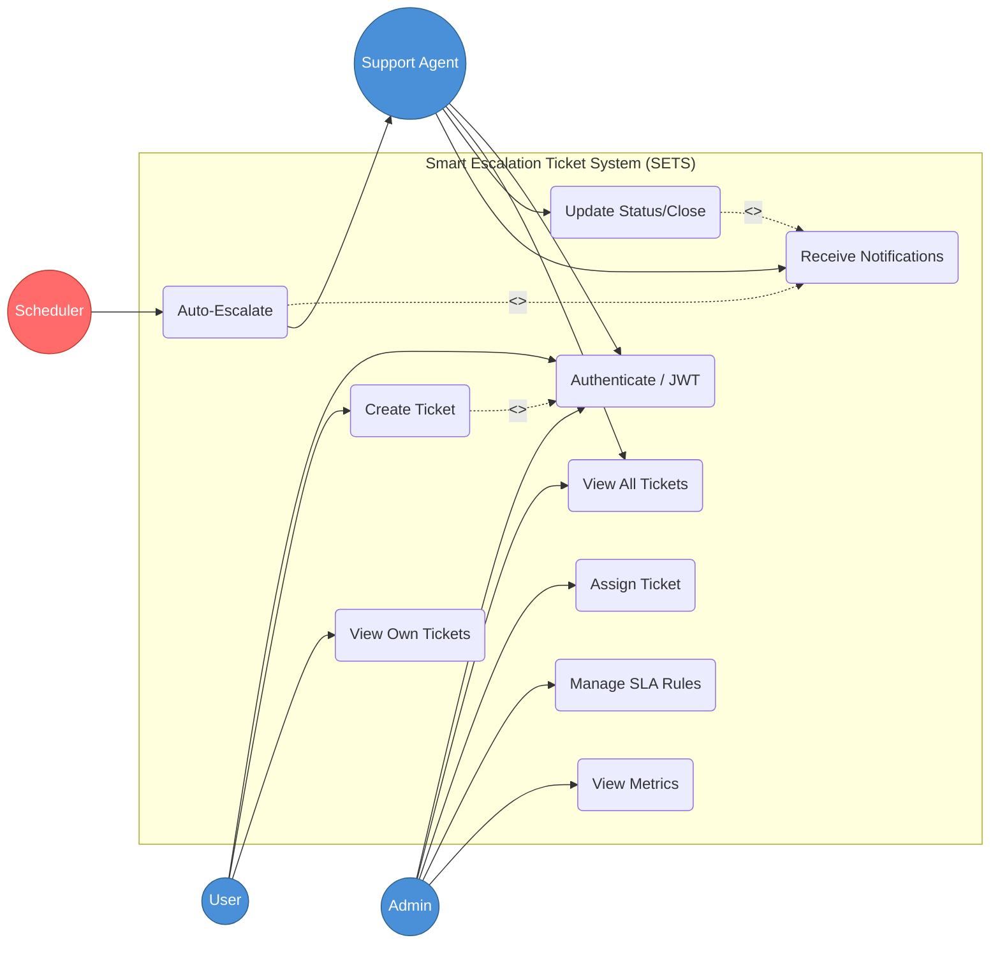

#  Use Case Diagram — SETS

## Overview

This use case diagram illustrates the interactions between **Admin**, **Support Agent**, and **User** within the Smart Escalation Ticket System. It highlights role-based access control and the automated system-driven escalation flow.

---

## Mermaid Use Case Diagram

### Flow Summary

| Phase | Description | Key Relationships |
| :--- | :--- | :--- |
| **1. Role-Based Access** | Segregates `User` (Submits), `Support` (Resolves), and `Admin` (Manages). | **RBAC**, **Actor Logic** |
| **2. Auth Barrier** | Mandatory `JWT Authentication` before any session-based activity. | **Precondition**, **JWT** |
| **3. Notification Trigger** | Status changes or breaches `<<include>>` notification events. | **Observer-like Flow** |
| **4. Autonomous Scaling** | `System Scheduler` monitors SLAs and triggers `Auto-Escalate` independently. | **Background Engine** |

---

## Use Case Descriptions

| # | Use Case | Actor(s) | Description |
| :--- | :--- | :--- | :--- |
| 1 | Authenticate / JWT | All Roles | Secure login providing role-specific access tokens. |
| 2 | Create Ticket | User | Submit a request with category, description, and impact level. |
| 3 | View Own Tickets | User | Track progress and history of personal submissions. |
| 4 | View All Tickets | Admin, Support | Overview of all active and historical tickets in the system. |
| 5 | Assign Ticket | Admin | Match tickets to specific Support Agents manually. |
| 6 | Manage SLA Rules | Admin | Configure time-to-resolve targets for P1-P4 priorities. |
| 7 | Update Status/Close | Support Agent | Transition tickets through lifecycle (In Progress → Resolved). |
| 8 | Auto-Escalate | System Scheduler | Automatically bump ticket level if SLA is breached. |
| 9 | View Metrics | Admin | Dashboards for resolution speed, breach rates, and team workload. |
| 10 | Receive Notifications | Support, User | Real-time alerts on assignment, escalation, or status changes. |
