# 📋 Use Case Diagram — SIEMS

## Overview

This use case diagram illustrates the interactions between the three primary actors (**Admin**, **Manager**, **Engineer**) and the system's core functionalities. It follows a structured approach to incident management, ensuring role-based access and automated escalation logic.

---

## Mermaid Use Case Diagram

```mermaid
flowchart LR

subgraph "Smart Incident & Escalation Management System (SIEMS)"
    direction TB

    %% Use Cases
    UC1(🔐 Login / Authenticate)
    UC2(📝 Create Incident)
    UC3(👁️ View Incidents)
    UC4(📌 Assign Incident)
    UC5(🔄 Update Incident Status)
    UC6(✅ Resolve Incident)
    UC7(⚙️ Configure Escalation Rules)
    UC8(⏰ Auto-Escalate Incident)
    UC9(📊 View Analytics / Reports)
    UC10(👥 Manage Users)
    UC11(📜 View Audit Logs)
    UC12(🔔 Receive Notification)

    %% Relationships
    UC5 -.->|"<<include>>"| UC11
    UC4 -.->|"<<include>>"| UC11
    UC8 -.->|"<<include>>"| UC11
    UC6 -.->|"<<extend>>"| UC5
    UC8 -.->|"<<include>>"| UC12
end

%% Actors
Admin((🛡️ Admin))
Manager((📋 Manager))
Engineer((🔧 Engineer))
System((⏱️ System Scheduler))

%% Admin Connections
Admin --> UC1
Admin --> UC10
Admin --> UC7
Admin --> UC9
Admin --> UC11
Admin --> UC3

%% Manager Connections
Manager --> UC1
Manager --> UC3
Manager --> UC4
Manager --> UC9
Manager --> UC11

%% Engineer Connections
Engineer --> UC1
Engineer --> UC2
Engineer --> UC3
Engineer --> UC5

%% System Connections
System --> UC8
UC12 --> Manager

%% Styling
style Admin fill:#4A90D9,stroke:#2C5F8A,color:#fff
style Manager fill:#4A90D9,stroke:#2C5F8A,color:#fff
style Engineer fill:#4A90D9,stroke:#2C5F8A,color:#fff
style System fill:#FF6B6B,stroke:#C0392B,color:#fff
```

### Flow Summary

| Phase | Description | Key Relationships |
| :--- | :--- | :--- |
| **1. Role-Based Access** | Distinguishes `Admin` (System/Rules), `Manager` (Teams), and `Engineer` (Tasks). | **Actor Specialization**, **RBAC** |
| **2. Auth First** | All actors must `Authenticate` via JWT before accessing system features. | **Precondition**, **Security Barrier** |
| **3. Process Inclusion** | All status-changing actions (`Assign`, `Update`, `Escalate`) mandate `Audit Logging`. | **<<include>>** (Mandatory) |
| **4. Lifecycle Extension** | `Resolve Incident` serves as a specialized completion of the `Update Status` flow. | **<<extend>>** (Terminal State) |
| **5. Autonomous Flow** | `System Scheduler` independently triggers `Auto-Escalate` based on time thresholds. | **Background Process** |

---

## Use Case Descriptions

| # | Use Case                     | Actor(s)              | Description                                                                 |
|---|------------------------------|-----------------------|-----------------------------------------------------------------------------|
| 1 | Login / Authenticate         | All Roles             | Authenticate via credentials; receive JWT token with role-based claims     |
| 2 | Create Incident              | Engineer              | Report a new incident with title, description, and severity                 |
| 3 | View Incidents               | All Roles             | View incident list filtered by role permissions                            |
| 4 | Assign Incident              | Manager               | Assign an OPEN incident to a specific Engineer                              |
| 5 | Update Incident Status       | Engineer              | Transition incident state (e.g., ASSIGNED → IN_PROGRESS)                    |
| 6 | Resolve Incident             | Engineer              | Finalize incident resolution and mark as RESOLVED                           |
| 7 | Configure Escalation Rules   | Admin                 | Define severity-based timeout thresholds and escalation targets             |
| 8 | Auto-Escalate Incident       | System Scheduler      | Background job checks for timed-out incidents and triggers escalation       |
| 9 | View Analytics / Reports     | Admin, Manager        | View dashboards for resolution time, escalation rates, and team metrics     |
| 10| Manage Users                 | Admin                 | CRUD operations on users and role management                                |
| 11| View Audit Logs              | Admin, Manager        | Review immutable log of all lifecycle events                                |
| 12| Receive Notification         | Manager               | Get notified on critical escalations via system events                      |

---

## Actor Permissions Matrix

| Use Case                   | Admin | Manager | Engineer | System |
|----------------------------|:-----:|:-------:|:--------:|:------:|
| Login / Authenticate       | ✅    | ✅      | ✅       | ❌     |
| Create Incident            | ❌    | ❌      | ✅       | ❌     |
| View Incidents             | ✅    | ✅      | ✅       | ❌     |
| Assign Incident            | ❌    | ✅      | ❌       | ❌     |
| Update Incident Status     | ❌    | ❌      | ✅       | ❌     |
| Resolve Incident           | ❌    | ❌      | ✅       | ❌     |
| Configure Escalation Rules | ✅    | ❌      | ❌       | ❌     |
| Auto-Escalate Incident     | ❌    | ❌      | ❌       | ✅     |
| View Analytics / Reports   | ✅    | ✅      | ❌       | ❌     |
| Manage Users               | ✅    | ❌      | ❌       | ❌     |
| View Audit Logs            | ✅    | ✅      | ❌       | ❌     |
